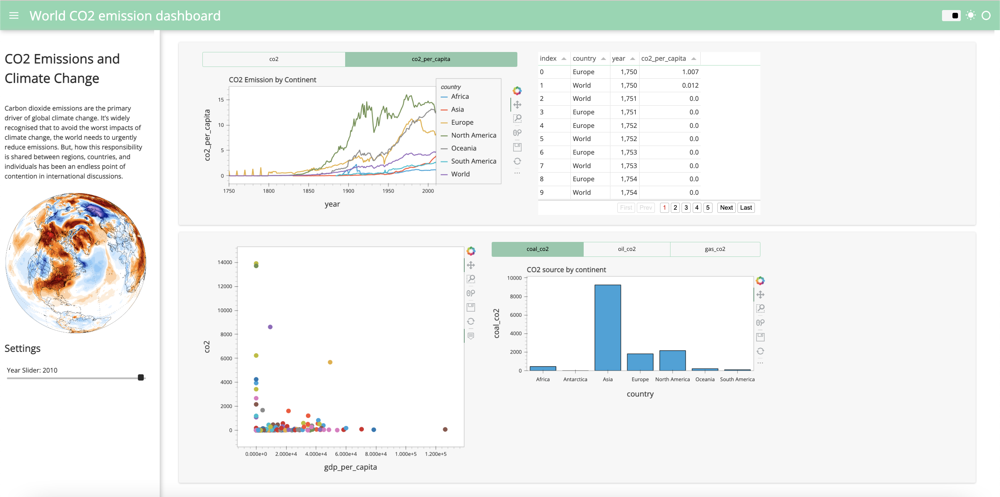

# Interactive Dashboard In Python with Panel
The dashboard displays insights on CO2 Emission Data throught Human History. 
To serve dashboard locally, use the command:
```bash
panel serve Interactive_Dashboard.ipynb
```

